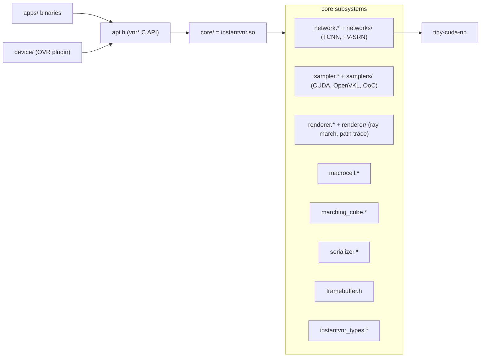

# Interactive Volume Visualization Via Multi-Resolution Hash Encoding Based Neural Representation

### Qi Wu, David Bauer, Michael J. Doyle, and Kwan-Liu Ma

Published in: IEEE Transactions on Visualization and Computer Graphics.

[Project Page](https://wilsoncernwq.github.io/publication/tvcg2022-instant-vnr) &middot;
[GitHub](https://github.com/VIDILabs/instantvnr) &middot;
[arXiv](https://arxiv.org/abs/2207.11620) &middot;
[Publisher's Version](https://ieeexplore.ieee.org/document/10175377)

### Abstract

Neural networks have shown great potential in compressing volume data for visualization. However, due to the high cost of training and inference, such volumetric neural representations have thus far only been applied to offline data processing and non-interactive rendering. In this paper, we demonstrate that by simultaneously leveraging modern GPU tensor cores, a native CUDA neural network framework, and a well-designed rendering algorithm with macro-cell acceleration, we can interactively ray trace volumetric neural representations (10-60fps). Our neural representations are also high-fidelity (PSNR > 30dB) and compact (10-1000x smaller). Additionally, we show that it is possible to fit the entire training step inside a rendering loop and skip the pre-training process completely. To support extreme-scale volume data, we also develop an efficient out-of-core training strategy, which allows our volumetric neural representation training to potentially scale up to terascale using only an NVIDIA RTX 3090 workstation.

### Project Layout

```
instant-vnr-paper/
├── api.h / api.cpp        Stable C-style wrapper around the library (vnr* functions).
├── api_internal.h         Internal composition types shared by api.cpp and device/.
├── core/                  instantvnr shared library: neural volumes, samplers,
│                          renderers, macrocell acceleration, marching cubes, JSON I/O.
├── device/                Optional OVR renderer plugin (registers "nnvolume").
│                          Built alongside the library but not linked by the apps here.
├── apps/                  Interactive and headless example programs (see table below).
├── base/                  OVR submodule: math (gdt), windowing/ImGui, JSON, transfer
│                          function editor, scene serializer, OpenGL helpers.
│   └── data/configs/      Example scene JSONs. See `base/data/configs/README.md`
│                          for the full schema.
├── tcnn/                  Pinned tiny-cuda-nn source tree (fetched as a submodule).
├── example-model.json     Example tiny-cuda-nn network config: `encoding` (HashGrid),
│                          `network` (FullyFusedMLP), `optimizer`, `loss`. Used as the
│                          `--network` argument to `vnr_cmd_train` and related apps.
├── Dockerfile
└── CMakeLists.txt
```

### Architecture

`apps/` binaries and the `device/` plugin both consume a single stable
C-style header, [`api.h`](api.h), implemented by the `instantvnr` shared
library under `core/`. `core/` is organized as a handful of cooperating
subsystems:



- **`core/network.*`** and **`core/networks/`** &mdash; `NeuralVolume` plus the
  tiny-cuda-nn (default) and fV-SRN (optional) backends. The `networks/tcnn_device_*`
  and `networks/tcnn_threadblock.h` files implement the fused in-shader inference
  path used by the `*_IN_SHADER` render modes.
- **`core/sampler.*`** and **`core/samplers/`** &mdash; training-data samplers
  wrapped in a uniform `SamplerAPI` interface: pure-CUDA, time-varying, optional
  OpenVKL, and an optional out-of-core sampler for terascale volumes.
- **`core/renderer.*`** and **`core/renderer/`** &mdash; CUDA ray marching and
  path tracing methods, selected by `vnrRenderMode` (see [`api.h`](api.h)).
  Each method has three internal variants &mdash; **decode**, **sample-streaming**,
  and **in-shader** &mdash; that trade memory bandwidth, latency, and register
  pressure differently.
- **`core/macrocell.*`** &mdash; coarse per-cell (min, max, max-opacity) grid used
  for empty-space skipping and delta-tracking majorants.
- **`core/marching_cube.*`** &mdash; GPU marching cubes over either a structured
  grid or a neural volume evaluated in-shader.
- **`core/serializer.*`** &mdash; loads VIDI-format scene JSON into
  `Camera`/`MultiVolume`/`TransferFunction` objects consumed by the apps.
- **`core/framebuffer.h`** &mdash; double-buffered CUDA framebuffer with
  overlapping host download streams.
- **`core/instantvnr_types.h`** &mdash; the split between host-side *scene* types
  and device-side *launch-parameter* types used throughout the renderer.

### Applications

All binaries land in the build's `bin/` directory. Pass `-h` to any app to see
its full CLI. The interactive viewers require `ENABLE_OPENGL` (on by default),
and the two isosurface binaries require `ENABLE_IN_SHADER` (on by default).

| Binary | Source | Purpose |
| --- | --- | --- |
| `vnr_int_dual` | [`apps/int_dual_volume.cpp`](apps/int_dual_volume.cpp) | Dual-pane interactive viewer: ground-truth volume on the left, neural volume trained and rendered live on the right. Includes PSNR/SSIM readouts, loss plot, and pause/resume for training, reference, and inference threads. |
| `vnr_int_single` | [`apps/int_volume.cpp`](apps/int_volume.cpp) | Single-pane interactive viewer for either a ground-truth or a pre-trained neural volume, with an ImGui transfer-function editor and rendering-mode selector. |
| `vnr_int_isosurface` | [`apps/int_isosurface.cu`](apps/int_isosurface.cu) | Interactive isosurface viewer (marching cubes + OSPRay ray tracing via OVR). Isovalue slider, optional path tracing. Requires `ENABLE_IN_SHADER`. |
| `vnr_cmd_train` | [`apps/batch_trainer.cpp`](apps/batch_trainer.cpp) | Headless trainer: loads a ground-truth volume and a network config, trains for a configurable number of steps, and writes `params.json`. |
| `vnr_cmd_render` | [`apps/batch_renderer.cpp`](apps/batch_renderer.cpp) | Headless benchmark renderer: times a fixed number of frames, writes a JPEG screenshot and a CSV timing log. |
| `vnr_cmd_isosurface` | [`apps/batch_isosurface.cpp`](apps/batch_isosurface.cpp) | Headless marching cubes: extracts a single iso-surface and writes `isosurface.obj`. Requires `ENABLE_IN_SHADER`. |
| `view_model` | [`apps/view_model.cpp`](apps/view_model.cpp) | Inspector for a neural-volume binary JSON (`params.json`): prints volume dimensions, macrocell metadata, model config, parameter size, and optional PSNR/SSIM against a ground-truth volume. |

Minimal invocation examples (run from the build directory after the data
symlink step below):

```bash
# Train a neural representation of vorts1, save weights to params.json
./vnr_cmd_train  --volume ./data/configs/scene_vorts1.json --network ./example-model.json

# Render 200 frames and write a screenshot + CSV timing log
./vnr_cmd_render --neural-volume ./params.json --tfn ./data/configs/scene_vorts1.json \
                 --rendering-mode 5 --num-frames 200 --exp vorts1

# Interactive side-by-side viewer with live training
./vnr_int_dual   --volume ./data/configs/scene_vorts1.json --network ./example-model.json \
                 --rendering-mode 5

# Interactive single-view of a pre-trained neural volume
./vnr_int_single --neural-volume ./params.json --tfn ./data/configs/scene_vorts1.json \
                 --rendering-mode 5

# Extract an iso-surface at value 5 to isosurface.obj
./vnr_cmd_isosurface --simple-volume ./data/configs/scene_vorts1.json --iso 5

# Inspect a neural JSON
./view_model ./params.json --groundtruth ./data/configs/scene_vorts1.json
```

Scene configuration files (`data/configs/scene_*.json`) describe the volume
data on disk and how to render it. Their schema is documented in
[`base/data/configs/README.md`](base/data/configs/README.md). The
`--network` / model config is a tiny-cuda-nn JSON with `encoding`, `network`,
`optimizer`, and `loss` sections; see [`example-model.json`](example-model.json)
for a working HashGrid + FullyFusedMLP example.

### Build Instructions

Requires an NVIDIA GPU with compute capability >= 7.0 and CUDA 11.x or
newer. On Linux, the recommended toolchain is gcc 9-11 plus CMake >= 3.24.

#### Standalone (recommended)

`CMakeLists.txt` already disables the OptiX and OSPRay OVR backends and
only pulls in what this project needs, so a one-line configure works:

```bash
git clone --recursive https://github.com/VIDILabs/instantvnr.git
cd instantvnr
cmake -S . -B build -DCMAKE_BUILD_TYPE=Release -DCMAKE_CUDA_ARCHITECTURES=86
cmake --build build --parallel

# Make the shipped sample configs visible under the build directory
ln -s ../base/data build/data
cp example-model.json build/
```

#### Inside an OVR projects tree (legacy)

Keep this layout if you want the apps to be built as part of a larger OVR
workspace:

```bash
git clone --recursive https://github.com/VIDILabs/open-volume-renderer.git
cd open-volume-renderer/projects
git clone --recursive https://github.com/VIDILabs/instantvnr.git
cd ..
cmake -S . -B build -DCMAKE_CUDA_ARCHITECTURES=86 -DOVR_BUILD_MODULE_NNVOLUME=ON
cmake --build build --parallel
```

#### Docker

A Dockerfile is provided for a reproducible build/run environment:

```bash
git clone --recursive https://github.com/VIDILabs/instantvnr.git
cd instantvnr
docker build -t instantvnr --build-arg="CUDA_ARCH=86" .
xhost +si:localuser:root

docker run --gpus device=0 --runtime=nvidia -ti --rm \
  -e DISPLAY -v /tmp/.X11-unix:/tmp/.X11-unix \
  -w /instantvnr/build instantvnr
```

#### Using `instantvnr` from another CMake project

`instantvnr` installs as a relocatable CMake package:

```bash
cmake -S . -B build -DCMAKE_BUILD_TYPE=Release -DCMAKE_CUDA_ARCHITECTURES=86
cmake --build build --parallel
cmake --install build --prefix /path/to/instantvnr-install
```

```cmake
find_package(instantvnr CONFIG REQUIRED)

add_executable(my_app main.cpp)
target_link_libraries(my_app PRIVATE instantvnr::instantvnr)
```

The exported target preserves the current include layout, so downstream code
can continue to `#include <api.h>`.

### Feature Flags

The project compiles several optional subsystems in or out via CMake cache
variables. Defaults shown below match the top-level [`CMakeLists.txt`](CMakeLists.txt).

| Flag | Default | Effect |
| --- | --- | --- |
| `CMAKE_CUDA_ARCHITECTURES` | *(unset)* | Pass explicitly, e.g. `86` for RTX 30-series, `89` for RTX 40-series. Required. |
| `ENABLE_IN_SHADER` | `ON` | Enables the fused in-shader TCNN inference path. Required by `vnr_int_isosurface` and `vnr_cmd_isosurface`, and by the `*_IN_SHADER` rendering modes. |
| `ENABLE_OUT_OF_CORE` | `ON` | Enables the mmap + AIO out-of-core training sampler used for volumes that do not fit on the GPU. Pulls in `libaio` on Linux. |
| `ENABLE_OPENGL` | follows `OVR_BUILD_OPENGL` | Required by the three interactive viewers (`vnr_int_*`). |
| `ENABLE_FVSRN` | `OFF` | Builds the alternative fV-SRN network backend. Forces `DISABLE_ADAPTIVE_SAMPLING=ON` and `KERNEL_DOUBLE_PRECISION`. |
| `DISABLE_ADAPTIVE_SAMPLING` | `OFF` | Defines `ADAPTIVE_SAMPLING=0` (disables macrocell-based empty-space skipping and majorant path tracing). Off by default &mdash; keep it off unless you build fV-SRN. |
| `MACROCELL_SIZE_MIP` | `4` | Macrocell edge length is `1 << MACROCELL_SIZE_MIP` voxels. |
| `IVNR_GLIBCXX_USE_CXX11_ABI` | `ON` | Set to `OFF` when linking against libraries built with the old libstdc++ ABI (e.g. some PyTorch wheels). |

Call `vnrCompilationStatus("build")` from your own code (or see the startup
banner printed by each app) for a runtime dump of the active flags.

### Citation

```bibtex
@article{wu2022instant,
  author={Wu, Qi and Bauer, David and Doyle, Michael J. and Ma, Kwan-Liu},
  journal={IEEE Transactions on Visualization and Computer Graphics}, 
  title={Interactive Volume Visualization Via Multi-Resolution Hash Encoding Based Neural Representation}, 
  year={2023},
  volume={},
  number={},
  pages={1-14},
  doi={10.1109/TVCG.2023.3293121}
}
```
